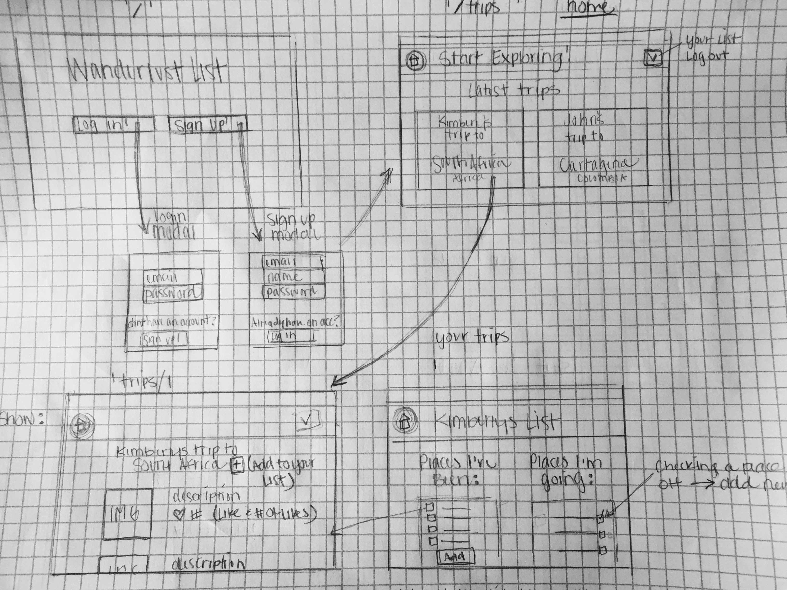
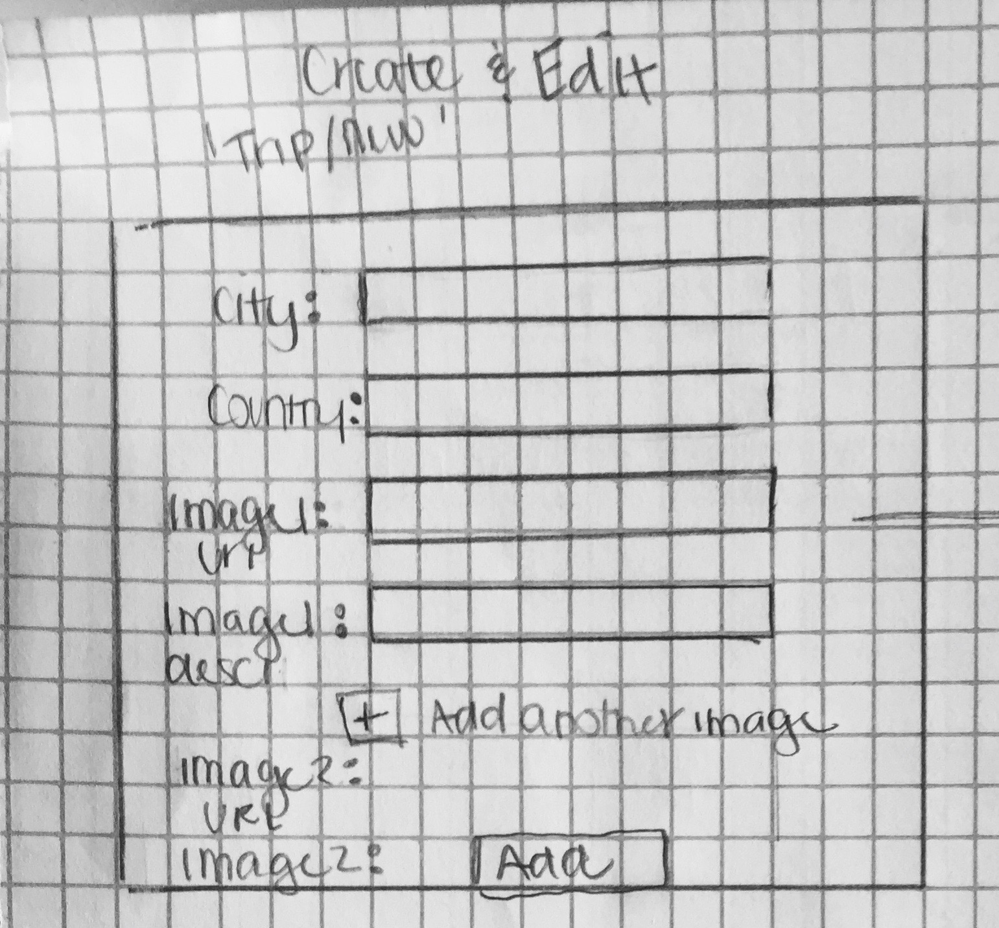

# README

# WanderList
### What is it?
WanderList is a full-stack Ruby on Rails web application that allows travelers to share photo collections from cities around the world. You can explore other users photo collections and find inspiration for your own future trips.

## Wireframe




### How is it made?
* [Ruby](https://www.ruby-lang.org/en/ "ruby.org")
* [Ruby on Rails](http://rubyonrails.org/ "rubyonrails.org")
    * [Devise](https://github.com/plataformatec/devise "Devise docs")
    * [CanCanCan](https://github.com/CanCanCommunity/cancancan "Cancancan Docs")
    * [foundation-rails](https://github.com/zurb/foundation-rails "Foundation Rails")
    * [jquery-turbolinks](https://github.com/kossnocorp/jquery.turbolinks "Jquery Turbolinks")
    * [carrierwave](https://github.com/carrierwaveuploader/carrierwave "Photo Upload")
    * [mini_magick](https://github.com/minimagick/minimagick "mini_magick")
    * [seed_dump](https://github.com/rroblak/seed_dump "Seed file generator")

    * Design - Google Fonts, foundation-rails (Navbar & buttons)
    * Project Planning - [Trello](https://trello.com/c/a1kHZcPC/8-features "Planning")
    * IDE - Atom 1.14.1

### Running WanderList Locally
WanderList is written in Ruby (v 2.3.1).
WanderList is written in Ruby on Rails (v 5.0.1).

Clone the project, bundle install, and start your server!
```sh
$ git clone https://github.com/kimberlywondo/wanderlust-list
$ bundle install
$ rails s
```

#### Deployed :: [WanderList]( "WanderList App")
#### Source Code :: [GitHub](https://github.com/kimberlywondo/wanderlust-list "GitHub Repo")
